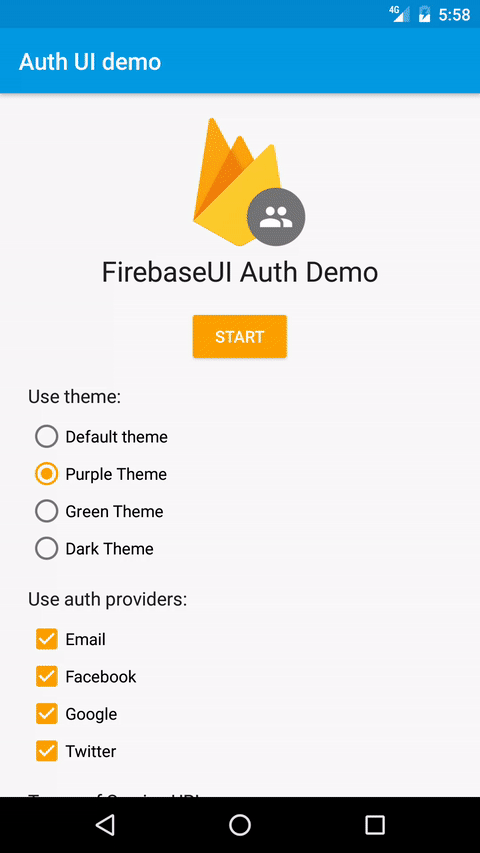

Firebase Authentication
==============================

Introduction
------------

- [Read more about Firebase Auth](https://firebase.google.com)

Getting Started
---------------

- [Add Firebase to your Android Project](https://firebase.google.com/docs/android/setup).

### Google Sign In Setup

- Go to the [Firebase Console](https://console.firebase.google.com) and navigate to your project:
  - Select the **Auth** panel and then click the **Sign In Method** tab.
  - Click **Google** and turn on the **Enable** switch, then click **Save**.
- Run the sample app on your device or emulator.
    - Select **GoogleSignInActivity** from the main screen.
    - Click the **Sign In** button to begin.

### Facebook Login Setup

- Go to the [Facebook Developers Site](https://developers.facebook.com) and follow all
  instructions to set up a new Android app.
  - When asked for a package name, use
  `com.google.firebase.quickstart.usermanagement`.
  - When asked for a main class name,
  use `com.google.firebase.quickstart.usermanagement.FacebookLoginActivity`.
- Go to the [Firebase Console](https://console.firebase.google.com) and navigate to your project:
  - Select the **Auth** panel and then click the **Sign In Method** tab.
  - Click **Facebook** and turn on the **Enable** switch, then click **Save**.
  - Enter your Facebook **App Id** and **App Secret** and click **Save**.
- Open the file `app/src/main/res/values/ids.xml` and replace the value of the `facebook_app_id` with the ID of the Facebook app you just created.
- Run the app on your device or emulator.
    - Select the **FacebookLoginActivity** from the main screen.
    - Click the **Sign In** button to begin.
    - If you see text that says Facebook is disabled, make sure you are running
      either the **facebookDebug** or **facebookRelease** variants of this sample.

### Twitter Login Setup

- Go to the [Twitter Developers Site](https://apps.twitter.com) and click **Create New App**
  instructions to set up a new Android app.
  - Go to the **Keys and Access Tokens** tab of your app and copy the **Consumer Key** and **Consumer Secret**.
- Go to the [Firebase Console](https://console.firebase.google.com) and navigate to your project:
  - Select the **Auth** panel and then click the **Sign In Method** tab.
  - Click **Twitter** and turn on the **Enable** switch, then click **Save**.
  - Enter your Twitter **Consumer Key** and **Consumer Secret** and click **Save**.
  - Copy the callback URL from the bottom of the panel (Ex.
    `https://<your-app-id>.firebaseapp.com/__/auth/handler`).
- Navigate back to your Twitter app settings on [Twitter Developers Site](https://apps.twitter.com). 
  - Click the **Settings** tab and
  paste in the callback URL from the Firebase console.
- Open the file `app/src/main/res/values/ids.xml` and replace the value of the **twitter_consumer_key**
  and **witter_consumer_secret** with the key and secret you just put into the Firebase console.
- Run the app on your device or emulator.
    - Select **TwitterLoginActivity** from the main screen.
    - Click the **Log In with Twitter** button to begin.

### Email/Password Setup

- Go to the [Firebase Console](https://console.firebase.google.com) and navigate to your project:
  - Select the **Auth** panel and then click the **Sign In Method** tab.
  - Click **Email/Password** and turn on the **Enable** switch, then click **Save**.
- Run the app on your device or emulator.
    - Select **EmailPasswordActivity** from the main screen.
    - Fill in your desired email and password and click **Create Account** to begin.
      
Result
-----------

